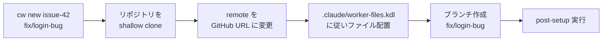

# cw

Git clone ベースのワーカー環境マネージャー。リポジトリの独立コピーを作り、並列で作業できるようにする。

## インストール

```bash
cargo install --git https://github.com/chronista-club/cw
```

---

## cw new すると何が起こるか

`cw new issue-42 fix/login-bug` を実行すると、以下の流れでワーカー環境が作られる。



1. カレントリポジトリを `~/.cache/cw/<リポ名>-issue-42` に `--depth 1` で clone する
2. clone 先の remote を GitHub の URL に差し替える（push 先を正しく設定）
3. `.claude/worker-files.kdl` を読み、指定されたファイルを symlink / copy する
4. `fix/login-bug` ブランチを作成する
5. `post-setup` が定義されていれば実行する（`bun install` など）

ワーカー名にはリポジトリ名が自動で prefix される（`issue-42` → `vantage-point-issue-42`）。

---

## 設定ファイル

プロジェクトの `.claude/worker-files.kdl` にワーカー環境へ配置するファイルを定義する。

```kdl
// symlink: 元リポジトリと共有（.env 等の変更が即反映）
symlink ".env"
symlink ".mcp.json"
symlink ".claude/settings.local.json"

// symlink-pattern: パターンで一括 symlink
symlink-pattern "**/*.local.*"
symlink-pattern "**/*.local"

// copy: 独立コピー（ワーカー側で自由に変更可能）
copy "config/dev.toml"

// post-setup: clone 後に実行するコマンド
post-setup "bun install"
```

| 種類 | 動作 | 用途 |
|------|------|------|
| `symlink` | 元ファイルへのシンボリックリンク | `.env`, `.mcp.json` など共有したいファイル |
| `copy` | 独立コピー | ワーカー側で変更が必要なファイル |
| `symlink-pattern` | glob パターンで一括 symlink | `*.local.*` など gitignore 対象のローカルファイル |
| `post-setup` | clone 後に実行するコマンド | `bun install`, `cargo build` など |

---

## コマンド

```bash
cw new <name> <branch>   # ワーカー環境を作成
cw ls                     # 一覧表示（名前・ブランチ・パス）
cw path <name>            # ワーカーのパスを出力
cw rm <name>              # 削除
cw rm --all               # 全ワーカーを削除
```

`cw path` は stdout にパスだけを出力するので、他のコマンドと組み合わせられる:

```bash
cd $(cw path issue-42)
```

ワーカーのデフォルト保存先は `~/.cache/cw/`。`CW_WORKERS_DIR` 環境変数で変更できる。

## ライセンス

[MIT](LICENSE-MIT) or [Apache-2.0](LICENSE-APACHE)
